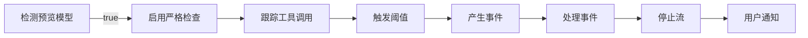
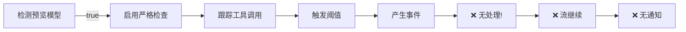

# 技术详细对比：Core vs VSCode-UI-Plugin 循环检测

## 目录

1. [架构对比](#架构对比)
2. [初始化流程对比](#初始化流程对比)
3. [执行流程详解](#执行流程详解)
4. [关键代码段对比](#关键代码段对比)
5. [数据流追踪](#数据流追踪)
6. [配置与常量](#配置与常量)

---

## 架构对比

### Core包（CLI）架构

```
┌─────────────────────────────────────────────────────────┐
│                    CLI Entry Point                      │
└────────────────────────┬────────────────────────────────┘
                         │
                         ▼
┌─────────────────────────────────────────────────────────┐
│                  GeminiClient Constructor                │
│  - config: Config                                        │
│  - loopDetector: LoopDetectionService  ✅               │
│  - chat: GeminiChat                                      │
│  - compressionService: CompressionService                │
└────────────────────────┬────────────────────────────────┘
                         │
                         ▼
┌─────────────────────────────────────────────────────────┐
│              GeminiClient.sendMessageStream()            │
│  - prompt_id: string                                     │
│  - loopDetector.reset(prompt_id) ✅                     │
│    └─ 检测: /preview/i.test(model)                     │
└────────────────────────┬────────────────────────────────┘
                         │
                    ┌────┴────┐
                    │          │
          ┌─────────▼──┐  ┌───▼──────────┐
          │ LLM Check  │  │  Turn.run()  │
          │ (Optional) │  │              │
          └────────────┘  └───┬──────────┘
                               │
                    ┌──────────┴──────────┐
                    │                     │
              ┌─────▼─────┐         ┌─────▼──────┐
              │ Tool Call │         │  Content   │
              │  Events   │         │  Events    │
              └─────┬─────┘         └─────┬──────┘
                    │                     │
            ┌───────┴──────────┬──────────┘
            │                  │
       ┌────▼─────┐     ┌──────▼──────┐
       │ addCheck │     │  addCheck   │
       │(name+arg)│     │  (content)  │
       └────┬─────┘     └──────┬──────┘
            │                  │
      ┌─────┴──────────────────┴──────┐
      │                               │
   ┌──▼──────────────────────────────┐│
   │  if (loopDetected) {             ││
   │    yield LoopDetected ✅         ││
   │    return turn                   ││
   │  }                               ││
   └──────────────────────────────────┘│
      └──────────────────────────────┘
              ✅ 正确处理
```

### VSCode插件架构

```
┌──────────────────────────────────────┐
│    VS Code Extension (webview)       │
└───────────────┬──────────────────────┘
                │
                ▼
┌──────────────────────────────────────┐
│       AIService Constructor           │
│  - config: Config (带GeminiClient)   │
│  - geminiClient: GeminiClient        │
│    └─ loopDetector ✅(存在)          │
└───────────────┬──────────────────────┘
                │
                ▼
┌──────────────────────────────────────┐
│  processChatMessage()                 │
│  → processStreamingResponseWithParts()│
└───────────────┬──────────────────────┘
                │
                ▼
┌──────────────────────────────────────┐
│  GeminiClient.sendMessageStream()    │
│  - prompt_id                         │
│  - loopDetector.reset() ✅          │
│    └─ 检测: /preview/i.test() ✅   │
└───────────────┬──────────────────────┘
                │
                ▼
┌──────────────────────────────────────┐
│  processGeminiStreamEvents()          │
│  for await (const event of stream) { │
│    switch(event.type) {              │
│      case Content: ...               │
│      case ToolCall: ...              │
│      case TokenUsage: ...            │
│      case Error: ...                 │
│      case Finished: ...              │
│      ❌ NO LoopDetected case!       │
│    }                                 │
│  }                                   │
└──────────────────────────────────────┘
         ❌ 事件被IGNORE
```

---

## 初始化流程对比

### Core包：完整初始化链

```typescript
// 1️⃣ 构造GeminiClient时
class GeminiClient {
  constructor(private config: Config) {
    // L93
    this.loopDetector = new LoopDetectionService(config);
  }
}

// 2️⃣ 发送消息流时
async *sendMessageStream(
  request: PartListUnion,
  signal: AbortSignal,
  prompt_id: string,  // ✅ 重要！
  turns: number = this.MAX_TURNS,
  originalModel?: string,
): AsyncGenerator<ServerGeminiStreamEvent, Turn> {

  // L509: 重置和模型检测
  if (this.lastPromptId !== prompt_id) {
    this.loopDetector.reset(prompt_id);  // ✅ 关键调用
    this.lastPromptId = prompt_id;
  }

  // reset()方法内部
  reset(promptId: string): void {
    this.promptId = promptId;

    // L576: 【关键】模型检测
    const currentModel = this.config.getModel();
    this.isPreviewModel = /preview/i.test(currentModel);

    if (this.isPreviewModel) {
      console.log(
        `[LoopDetection] Detected preview model: ${currentModel}, ` +
        `enabling strict tool-name checking`
      );
    }

    this.resetToolCallCount();
    this.resetContentTracking();
    this.resetLlmCheckTracking();
    this.loopDetected = false;
    this.detectedLoopType = null;
  }
}
```

### VSCode插件：初始化链（部分缺失）

```typescript
// 1️⃣ 构造AIService时
class AIService {
  private geminiClient?: GeminiClient;

  async initialize(...) {
    // GeminiClient已初始化（包含loopDetector）
    this.geminiClient = this.config.getGeminiClient();
  }
}

// 2️⃣ 处理聊天消息
async processChatMessage(message: ChatMessage, context?: ContextInfo) {
  const responseId = `ai-response-${Date.now()}`;

  const result = await ContextBuilder.buildContextualContent(
    message.content,
    context
  );

  // ✅ prompt_id使用message.id
  await this.processStreamingResponseWithParts(
    message.id,  // prompt_id
    result.parts,
    responseId
  );
}

// 3️⃣ 处理流式响应
private async processStreamingResponseWithParts(
  prompt_id: string,  // ✅ 正确传递
  parts: PartListUnion,
  responseId: string
): Promise<void> {
  const stream = this.geminiClient!.sendMessageStream(
    parts,
    abortController.signal,
    prompt_id  // ✅ 传递给GeminiClient
  );

  // 【关键】processGeminiStreamEvents接收流
  // 但没有处理LoopDetected事件！
  await this.processGeminiStreamEvents(
    stream,
    { id: responseId, ... },
    undefined,
    abortController.signal,
    responseId
  );
}

// 4️⃣ 流事件处理【缺陷】
private async processGeminiStreamEvents(
  stream: AsyncIterable<ServerGeminiStreamEvent>,
  ...
): Promise<void> {
  for await (const event of stream) {
    switch (event.type) {
      case GeminiEventType.Content: ...
      case GeminiEventType.ToolCallRequest: ...
      case GeminiEventType.TokenUsage: ...
      case GeminiEventType.Error: ...
      case GeminiEventType.Finished: ...
      // ❌ 缺失: case GeminiEventType.LoopDetected: ...
    }
  }
}
```

**关键差异**:
- ✅ Core: 在yield前检查和处理LoopDetected
- ❌ VSCode: 接收到LoopDetected但没有switch case处理

---

## 执行流程详解

### 场景：预览模型 + read_file重复调用（4次）

#### Core包执行轨迹

```
时刻    操作                              状态值
────────────────────────────────────────────────────────────
T0      GeminiClient.constructor()
        → new LoopDetectionService()    loopDetector = new ✅

T1      sendMessageStream(parts, signal, 'msg-123')
        → loopDetector.reset('msg-123')

T2      reset()执行
        currentModel = 'gemini-3-pro-preview'
        isPreviewModel = /preview/i.test(...) = true ✅
        CONSOLE: [LoopDetection] Detected preview model...

T3      await loopDetector.turnStarted(signal)
        (可选的LLM检查)
        return false (无LLM检测到的循环)

T4      turn.run(request, signal) 开始
        (产生流事件)

T5      Event #1: ToolCallRequest
        {name: 'read_file', args: {path: 'a.ts'}}

        → loopDetector.addAndCheck(event)
          → checkToolCallLoop({name: 'read_file', ...})
             → key = hash('read_file:{path:a.ts}')
             → lastToolCallKey ≠ key
             → toolCallRepetitionCount = 1 (无精确匹配)
             → isPreviewModel = true
             → checkPreviewModelToolNameLoop()
                → toolNameCallCounts['read_file'] = 1
                → isIntensiveTool = true
                → threshold = 4
                → 1 < 4 → return false
        → loopDetected = false ✅
        → yield Content/ToolCallRequest event

T6      Event #2: ToolCallRequest
        {name: 'read_file', args: {path: 'b.ts'}}
        (不同的args)

        → loopDetector.addAndCheck(event)
          → checkPreviewModelToolNameLoop()
             → toolNameCallCounts['read_file'] = 2
             → 2 < 4 → return false
        → loopDetected = false
        → yield event

T7      Event #3: ToolCallRequest
        {name: 'read_file', args: {path: 'c.ts'}}

        → toolNameCallCounts['read_file'] = 3
        → return false
        → yield event

T8      Event #4: ToolCallRequest
        {name: 'read_file', args: {path: 'd.ts'}}

        → loopDetector.addAndCheck(event)
          → checkPreviewModelToolNameLoop()
             → toolNameCallCounts['read_file'] = 4
             → 4 >= 4 ✅ 检测到循环!
             → CONSOLE.warn('[LoopDetection] Preview model loop detected:
                             tool "read_file" called 4 times')
             → logLoopDetected(...)
             → detectedLoopType = CONSECUTIVE_IDENTICAL_TOOL_CALLS
             → return true
        → loopDetected = true

T9      在client.ts: if (loopDetector.addAndCheck(event)) {
          yield { type: LoopDetected, value: '...' } ✅
          return turn  // 立即返回，停止处理
        }

T10     调用方接收LoopDetected事件
        流停止，AI停止响应 ✅✅✅
```

#### VSCode插件执行轨迹

```
时刻    操作                              差异
────────────────────────────────────────────────────────────
T0-T8   完全相同（都在GeminiClient内执行）
        ✅ GeminiClient检测到循环
        ✅ yield LoopDetected事件

T9      processGeminiStreamEvents接收事件
        for await (const event of stream) {
          // event.type = GeminiEventType.LoopDetected
          // event.value = '...'

          switch(event.type) {
            case LoopDetected:
              ❌ 没有这个case!
              事件被忽略(fall through)
              继续for循环
          }
        }

T10     流等待下一个事件
        如果有更多事件，继续处理
        如果流结束，for循环退出

        ❌ 循环检测事件被SILENT IGNORE
        ❌ 用户不知道发生了循环检测
        ❌ 流继续运行（如果还有事件）
```

**关键区别**:
- Core: T9处立即返回，停止流
- VSCode: T9处事件被忽略，流继续

---

## 关键代码段对比

### 1. 模型检测

#### Core包（LoopDetectionService.ts:574-578）

```typescript
reset(promptId: string): void {
  this.promptId = promptId;

  // Detect if current model is a preview model for stricter checking
  const currentModel = this.config.getModel();
  this.isPreviewModel = /preview/i.test(currentModel);
  if (this.isPreviewModel) {
    console.log(`[LoopDetection] Detected preview model: ${currentModel}, enabling strict tool-name checking`);
  }

  this.resetToolCallCount();
  this.resetContentTracking();
  this.resetLlmCheckTracking();
  this.loopDetected = false;
  this.detectedLoopType = null;
}
```

#### VSCode插件（None!）

❌ 没有对应代码。检测执行但结果未使用。

### 2. 工具调用检测

#### Core包（LoopDetectionService.ts:199-262）

```typescript
private checkToolCallLoop(toolCall: { name: string; args: object }): boolean {
  // Check 1: Standard exact match detection (name + args hash)
  const key = this.getToolCallKey(toolCall);
  if (this.lastToolCallKey === key) {
    this.toolCallRepetitionCount++;
  } else {
    this.lastToolCallKey = key;
    this.toolCallRepetitionCount = 1;
  }

  if (this.toolCallRepetitionCount >= TOOL_CALL_LOOP_THRESHOLD) {
    this.detectedLoopType = LoopType.CONSECUTIVE_IDENTICAL_TOOL_CALLS;
    logLoopDetected(...);
    return true;
  }

  // Check 2: Preview model strict checking (tool name only, ignoring args)
  if (this.isPreviewModel) {
    return this.checkPreviewModelToolNameLoop(toolCall);
  }

  return false;
}

private checkPreviewModelToolNameLoop(toolCall: { name: string; args: object }): boolean {
  const toolName = toolCall.name;
  const currentCount = (this.toolNameCallCounts.get(toolName) || 0) + 1;
  this.toolNameCallCounts.set(toolName, currentCount);

  // Determine threshold based on tool type
  const isIntensiveTool = PREVIEW_INTENSIVE_TOOLS.has(toolName);
  const threshold = isIntensiveTool
    ? PREVIEW_INTENSIVE_TOOL_THRESHOLD
    : PREVIEW_TOOL_NAME_LOOP_THRESHOLD;

  if (currentCount >= threshold) {
    console.warn(
      `[LoopDetection] Preview model loop detected: tool '${toolName}' called ${currentCount} times (threshold: ${threshold})`
    );
    this.detectedLoopType = LoopType.CONSECUTIVE_IDENTICAL_TOOL_CALLS;
    logLoopDetected(...);
    return true;
  }

  return false;
}
```

#### VSCode插件（None!）

❌ 没有对应代码，但内部的GeminiClient有此逻辑。

### 3. 事件处理

#### Core包（client.ts:617-626）

```typescript
const resultStream = turn.run(request, signal);
for await (const event of resultStream) {
  if (this.loopDetector.addAndCheck(event)) {
    const loopType = this.loopDetector.getDetectedLoopType();
    yield { type: GeminiEventType.LoopDetected, value: loopType ? loopType.toString() : undefined };
    // Add feedback to chat history so AI understands why it was stopped
    this.addLoopDetectionFeedbackToHistory(loopType);
    return turn;  // ✅ 立即返回！
  }

  // 处理TokenUsage事件，累积token计数并判断是否需要下次压缩
  if (event.type === GeminiEventType.TokenUsage) {
    // ...
  } else {
    yield event;
  }
}
```

#### VSCode插件（aiService.ts:1469-1530）

```typescript
private async processGeminiStreamEvents(
  stream: AsyncIterable<ServerGeminiStreamEvent>,
  originalMessage: ChatMessage,
  context: ContextInfo | undefined,
  signal: AbortSignal,
  responseId: string
): Promise<void> {
  const toolCallRequests: ToolCallRequestInfo[] = [];
  this.isCurrentlyResponding = true;

  try {
    for await (const event of stream) {
      if (signal.aborted) break;

      switch (event.type) {
        case GeminiEventType.Content:
          // ... 处理
          break;

        case GeminiEventType.Reasoning:
          // ... 处理
          break;

        case GeminiEventType.ToolCallRequest:
          // ... 处理
          break;

        case GeminiEventType.TokenUsage:
          // ... 处理
          break;

        case GeminiEventType.Error:
          // ... 处理
          break;

        case GeminiEventType.Finished:
          // ... 处理
          break;

        // ❌ 缺失: case GeminiEventType.LoopDetected:
      }
    }
    // ... 后续处理
  }
}
```

---

## 数据流追踪

### 预览模型 + 工具重复场景的完整数据流

```
发送消息
  ↓
GeminiClient.sendMessageStream(
  parts: [{ text: "..." }],
  signal: AbortSignal,
  prompt_id: "msg-123"
)
  ↓
【GeminiClient内部】
  ├─ loopDetector.reset("msg-123")
  │  └─ isPreviewModel = true (via /preview/i.test())
  │  └─ toolNameCallCounts = {} (清空)
  │
  ├─ Turn.run()
  │  └─ chat.sendMessageStream()
  │     └─ 产生流事件序列
  │
  └─ for await (const event of resultStream)
     ├─ if (loopDetector.addAndCheck(event)) → true at T8
     │  ├─ addAndCheck():
     │  │  ├─ checkToolCallLoop():
     │  │  │  ├─ 第一层检查: name+args hash (不匹配)
     │  │  │  ├─ 第二层检查: isPreviewModel = true
     │  │  │  └─ checkPreviewModelToolNameLoop():
     │  │  │     ├─ toolNameCallCounts['read_file']++ = 4
     │  │  │     ├─ threshold = 4 (intensive tool)
     │  │  │     ├─ 4 >= 4 → 触发!
     │  │  │     └─ return true
     │  │  └─ return true
     │  │
     │  ├─ getDetectedLoopType() → CONSECUTIVE_IDENTICAL_TOOL_CALLS
     │  └─ yield { type: LoopDetected, value: "..." }
     │
     │  【Core：立即return，停止处理】✅
     │  【VSCode：...?】❌
     │
     └─ yield event (其他事件)

VSCode插件端：
processGeminiStreamEvents(stream, ...)
  ├─ for await (const event of stream)
  │  ├─ event.type = LoopDetected
  │  └─ switch (event.type)
  │     └─ ❌ 没有case处理
  │        → 事件被忽略
  │        → for循环继续
  │
  └─ (流结束或继续等待)
```

---

## 配置与常量

### 预览模型检测常量对比

#### Core包（LoopDetectionService.ts:22-43）

```typescript
// 标准模型阈值
const TOOL_CALL_LOOP_THRESHOLD = 10;              // 所有模型
const CONTENT_LOOP_THRESHOLD = 20;                // 所有模型

// 预览模型阈值
const PREVIEW_TOOL_NAME_LOOP_THRESHOLD = 5;       // 预览模型-普通工具
const PREVIEW_INTENSIVE_TOOL_THRESHOLD = 4;       // 预览模型-高开销工具

// 预览模型高开销工具列表
const PREVIEW_INTENSIVE_TOOLS = new Set([
  'read_file',
  'read_many_files',
  'glob',
  'search_file_content',
  'ls',
]);

// LLM检查相关
const LLM_LOOP_CHECK_HISTORY_COUNT = 20;          // 检查时包含的历史轮数
const LLM_CHECK_AFTER_TURNS = 30;                 // 多少轮后启用LLM检查
const DEFAULT_LLM_CHECK_INTERVAL = 3;             // 默认检查间隔
const MIN_LLM_CHECK_INTERVAL = 5;                 // 最小间隔
const MAX_LLM_CHECK_INTERVAL = 15;                // 最大间隔
```

#### VSCode插件

❌ 这些常量完全不存在。它们隐含在GeminiClient内部的LoopDetectionService中，但插件无法访问或配置。

### 模型识别模式

#### Core包

```typescript
// 简单的正则表达式匹配
/preview/i.test(currentModel)

// 匹配示例
- "gemini-3-pro-preview"         ✅ Match
- "gemini-pro-preview"           ✅ Match
- "gemini-2.0-flash-preview"     ✅ Match
- "gemini-2.0-flash"             ❌ No Match
- "gemini-1.5-pro"               ❌ No Match
- "claude-3-opus"                ❌ No Match
```

#### VSCode插件

❌ 无法自定义。完全依赖GeminiClient的配置。

---

## 对比总结表

| 方面 | Core包 | VSCode插件 | 差异 |
|------|--------|----------|------|
| **LoopDetectionService** | ✅ 初始化 | ✅ 通过GeminiClient | 无差异 |
| **模型检测** | ✅ /preview/i | ✅ 执行 | ✅ 相同 |
| **工具跟踪** | ✅ Map<name, count> | ✅ 执行 | ✅ 相同 |
| **阈值应用** | ✅ 4/5 | ✅ 执行 | ✅ 相同 |
| **事件产生** | ✅ yield | ✅ 产生 | ✅ 相同 |
| **事件处理** | ✅ switch case + return | ❌ 无handler | ❌ 关键缺陷 |
| **流停止** | ✅ return turn | ❌ 继续运行 | ❌ 关键缺陷 |
| **用户反馈** | ✅ 错误消息 | ❌ 无 | ❌ 关键缺陷 |

---

## 对比结论

### ✅ Core包（完整实现）



### ❌ VSCode插件（缺陷链）



### 根本原因

**VSCode插件在事件处理层缺少LoopDetected的switch case**

这是一个纯粹的事件处理缺陷，而不是检测机制的问题。

---

## 修复验证清单

修复后应验证：

- [ ] LoopDetected事件被正确捕获
- [ ] 错误消息显示给用户
- [ ] 流立即停止（不继续处理事件）
- [ ] 会话状态被正确保存
- [ ] 日志显示警告消息
- [ ] 预览模型阈值为4/5（非10）
- [ ] 标准模型阈值保持为10
- [ ] 无回归（其他事件仍正常处理）

