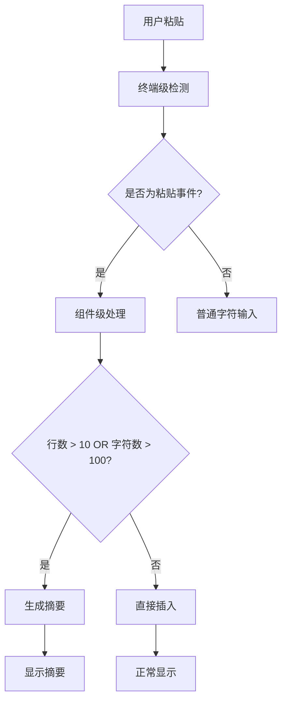
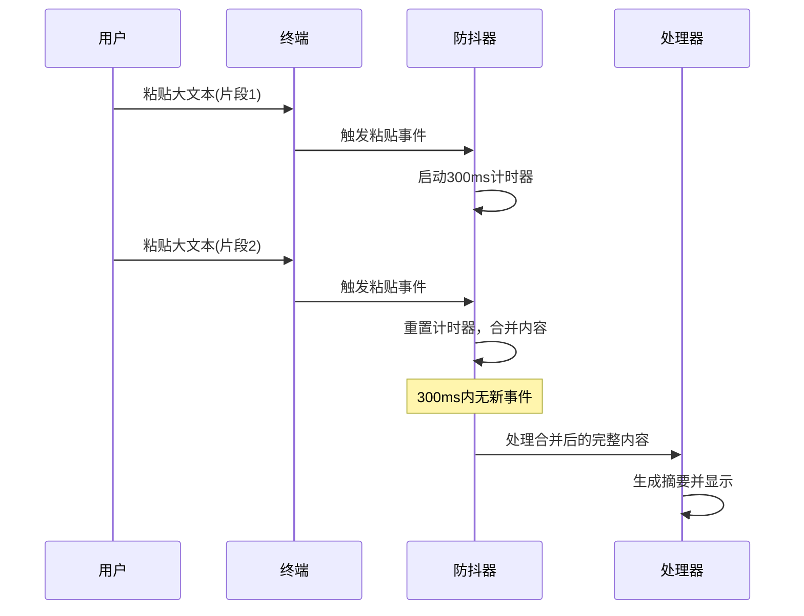
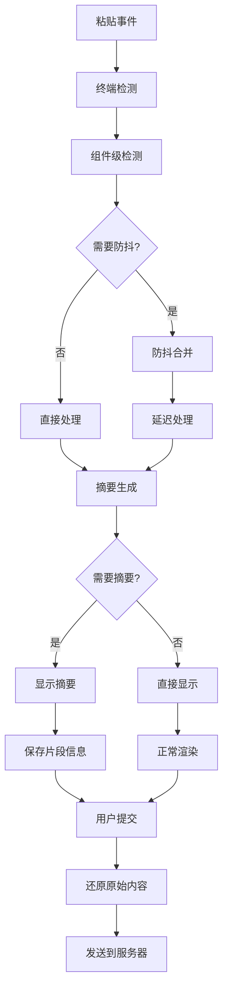

# DeepV Code CLI 输入组件 - 粘贴文本处理机制

## 概述

DeepV Code CLI 输入组件实现了一套完整的大量文本粘贴处理机制，包括智能检测、自动摘要、防抖合并和无缝还原等功能。本文档详细介绍了这套机制的核心逻辑和实现细节。

## 1. 粘贴检测机制

### 1.1 多层检测策略

系统采用多层检测策略确保准确识别粘贴操作：

**A. 终端级别检测 (useKeypress.ts)**

```typescript
// 支持标准 bracketed paste 模式
const PASTE_MODE_PREFIX = Buffer.from('\x1B[200~');
const PASTE_MODE_SUFFIX = Buffer.from('\x1B[201~');

// Windows 特殊处理：更强的粘贴检测逻辑
if (isWindows) {
  const hasNewlines = dataStr.includes('\r') || dataStr.includes('\n');
  const hasMultipleChars = data.length > 1;
  const hasMultipleLines = dataStr.split(/\r?\n/).length > 1;
  
  // 启发式判断：包含换行符且字符数>1，或者是多行文本
  if ((hasNewlines && hasMultipleChars) || hasMultipleLines) {
    // 强制当作粘贴处理
    handleKeypress(undefined, createPasteKeyEvent('paste-start'));
    keypressStream.write(data);
    handleKeypress(undefined, createPasteKeyEvent('paste-end'));
  }
}
```

**B. 组件级别检测阈值**

```typescript
// 双重阈值控制
const LONG_PASTE_THRESHOLD = 10;           // 超过10行显示摘要
const LONG_PASTE_CHAR_THRESHOLD = 100;     // 超过100字符也显示摘要
```

**C. 真实换行符检测**

```typescript
// 区分真正的换行符和字面量字符串
const hasRealLineBreaks = (content: string): boolean => {
  return /[\r\n]/.test(content);
};

const getRealLineCount = (content: string): number => {
  const normalized = content.replace(/\r\n/g, '\n').replace(/\r/g, '\n');
  return normalized.split('\n').length;
};
```

### 1.2 检测流程



## 2. 文本摘要生成

### 2.1 智能摘要策略

```typescript
const createPasteSegment = (content: string): PasteSegment | null => {
  // 只处理包含真正换行符的文本
  if (!hasRealLineBreaks(content)) {
    return null; // 单行文本，不需要摘要
  }
  
  const realLineCount = getRealLineCount(content);
  const contentLength = content.length;
  
  // 双重条件：行数超过10行 OR 字符数超过100个
  if (realLineCount <= LONG_PASTE_THRESHOLD && contentLength <= LONG_PASTE_CHAR_THRESHOLD) {
    return null;
  }
  
  // 生成唯一序号
  pasteCounterRef.current += 1;
  const pasteNumber = pasteCounterRef.current;
  
  // 简洁的摘要格式
  const summaryContent = `[ PASTE #${pasteNumber}: ${realLineCount} lines]`;
  
  return {
    originalContent: content,
    summaryContent
  };
};
```

### 2.2 摘要数据结构

```typescript
interface PasteSegment {
  originalContent: string;    // 原始粘贴内容
  summaryContent: string;     // 显示的摘要文本
}
```

## 3. 防抖和分片处理

### 3.1 智能合并机制

```typescript
// 智能合并策略：短时间内的多个粘贴事件可能是同一个大文本被分割
if (now - lastPasteTimeRef.current < 2000 && pendingPasteContentRef.current) {
  console.log('检测到可能的分割粘贴，合并内容');
  pendingPasteContentRef.current += key.sequence;
  
  // 延长等待时间，看是否还有更多片段
  if (pasteTimeoutRef.current) {
    clearTimeout(pasteTimeoutRef.current);
  }
  
  pasteTimeoutRef.current = setTimeout(() => {
    processMultiSegmentPaste();
  }, 500); // 延长等待时间
}
```

### 3.2 分片处理延迟

```typescript
// 延迟处理，等待可能的后续片段
pasteTimeoutRef.current = setTimeout(() => {
  const finalContent = pendingPasteContentRef.current;
  pendingPasteContentRef.current = '';
  
  const pasteSegment = createPasteSegment(finalContent);
  
  if (pasteSegment) {
    // 保存片段信息
    setPasteSegments(prev => [...prev, pasteSegment]);
    
    // 显示摘要而不是原始内容
    const newInput = input.slice(0, cursorPosition) + pasteSegment.summaryContent + input.slice(cursorPosition);
    setInput(newInput);
    setCursorPosition(cursorPosition + pasteSegment.summaryContent.length);
  } else {
    // 短文本正常处理
    insertDirectly(finalContent);
  }
}, 300); // 300ms等待时间
```

### 3.3 防抖时序图



## 4. 摘要显示与还原

### 4.1 用户界面显示

```typescript
// 长文本粘贴状态显示
{pasteSegments.length > 0 && (
  <Box marginTop={1} flexDirection="column">
    <Text color={Colors.AccentYellow}>
      💡 检测到 {pasteSegments.length} 个长文本粘贴
    </Text>
    {pasteSegments.map((segment, index) => (
      <Text key={index} color={Colors.Gray} dimColor>
        • 片段 {index + 1}: {getRealLineCount(segment.originalContent)} 行内容
      </Text>
    ))}
  </Box>
)}
```

### 4.2 无缝还原机制

```typescript
const reconstructFullMessage = (summaryText: string): string => {
  let fullMessage = summaryText;
  
  // 按照粘贴顺序逐个替换，使用精确匹配避免冲突
  pasteSegments.forEach((segment) => {
    const summary = segment.summaryContent;
    const original = segment.originalContent;
    
    // 只替换完全匹配的摘要，避免部分匹配导致的问题
    if (fullMessage.includes(summary)) {
      fullMessage = fullMessage.replaceAll(summary, original);
    }
  });
  
  return fullMessage;
};
```

### 4.3 自动清理机制

```typescript
// 清理无效的粘贴片段（摘要被用户删除的情况）
const cleanupInvalidSegments = () => {
  const currentText = buffer.text;
  setPasteSegments(prev => 
    prev.filter(segment => currentText.includes(segment.summaryContent))
  );
};
```

## 5. 核心工具函数

### 5.1 Unicode 安全处理

```typescript
// Unicode‑aware helpers (工作在 code‑point 级别而不是 UTF‑16)
export function toCodePoints(str: string): string[] {
  return Array.from(str);  // 正确处理 surrogate‑pair emoji
}

export function cpLen(str: string): number {
  return toCodePoints(str).length;
}

export function cpSlice(str: string, start: number, end?: number): string {
  const arr = toCodePoints(str).slice(start, end);
  return arr.join('');
}
```

### 5.2 性能优化

```typescript
// 字符宽度计算缓存
const charWidthCache = new Map<string, number>();
const getCachedCharWidth = (char: string): number => {
  if (charWidthCache.has(char)) {
    return charWidthCache.get(char)!;
  }
  const width = stringWidth(char);
  charWidthCache.set(char, width);
  return width;
};

// 短文本优化路径
const optimizedLayout = useMemo(() => {
  if (text.length < 500 && lines.length === 1 && !text.includes('\n')) {
    // 单行短文本的简化布局
    return createSimpleLayout(text);
  }
  return calculateComplexLayout(lines);
}, [text, lines]);
```

## 6. 数据流架构

### 6.1 完整数据流



### 6.2 状态管理

```typescript
// 核心状态
const [input, setInput] = useState('');
const [pasteSegments, setPasteSegments] = useState<PasteSegment[]>([]);

// 防抖状态
const lastPasteTimeRef = useRef(0);
const pendingPasteContentRef = useRef('');
const pasteTimeoutRef = useRef<NodeJS.Timeout | null>(null);
const pasteCounterRef = useRef(0);
```

## 7. 关键设计原则

### 7.1 用户体验优先

- **非阻塞**: 粘贴操作不会阻塞界面
- **即时反馈**: 立即显示摘要，用户知道粘贴成功
- **透明还原**: 提交时自动还原，用户无感知

### 7.2 性能优化

- **智能阈值**: 只对大文本生成摘要
- **缓存机制**: 缓存字符宽度计算
- **防抖合并**: 避免频繁处理分片事件

### 7.3 兼容性保证

- **跨平台**: Windows/Mac/Linux 统一体验
- **Unicode 安全**: 正确处理多字节字符和 emoji
- **终端兼容**: 支持各种终端的粘贴模式

## 8. 使用示例

### 8.1 普通粘贴

```bash
# 用户粘贴短文本 (< 10行且 < 100字符)
$ 这是一段短文本 | 直接显示，无摘要

# 用户粘贴长文本 (> 10行或 > 100字符)
$ [ PASTE #1: 25 lines] | 显示摘要，保存原始内容
```

### 8.2 多次粘贴

```bash
# 用户连续粘贴多个长文本
$ [ PASTE #1: 25 lines] 然后 [ PASTE #2: 15 lines]

# 状态显示
💡 检测到 2 个长文本粘贴
• 片段 1: 25 行内容
• 片段 2: 15 行内容
```

### 8.3 提交还原

```bash
# 用户提交时
输入: "请分析这个文件 [ PASTE #1: 25 lines]"
发送: "请分析这个文件 \n[原始25行完整内容]"
```

## 9. 故障排除

### 9.1 常见问题

**问题**: 短文本被误识别为需要摘要
**解决**: 检查 `hasRealLineBreaks` 函数，确保只有真正的多行文本才生成摘要

**问题**: 分片粘贴没有正确合并
**解决**: 调整防抖延迟时间 (当前300ms)，确保所有分片都被捕获

**问题**: 摘要还原后内容不匹配
**解决**: 确保摘要文本的唯一性，避免重复替换

### 9.2 调试技巧

```typescript
// 启用详细日志
console.log('[Paste Debug] 检测到粘贴:', {
  sequence: key.sequence,
  length: key.sequence.length,
  lineCount: getRealLineCount(key.sequence),
  hasNewlines: hasRealLineBreaks(key.sequence)
});
```

## 10. 未来改进方向

1. **智能摘要**: 显示文本内容的智能摘要而不仅仅是行数
2. **预览功能**: 悬停查看摘要的部分内容
3. **分类标记**: 根据内容类型 (代码/文档/数据) 显示不同图标
4. **压缩存储**: 对超大文本进行压缩存储以节省内存

---

*该文档基于 DeepV Code CLI v1.0.67 版本编写，如有更新请参考最新代码实现。*